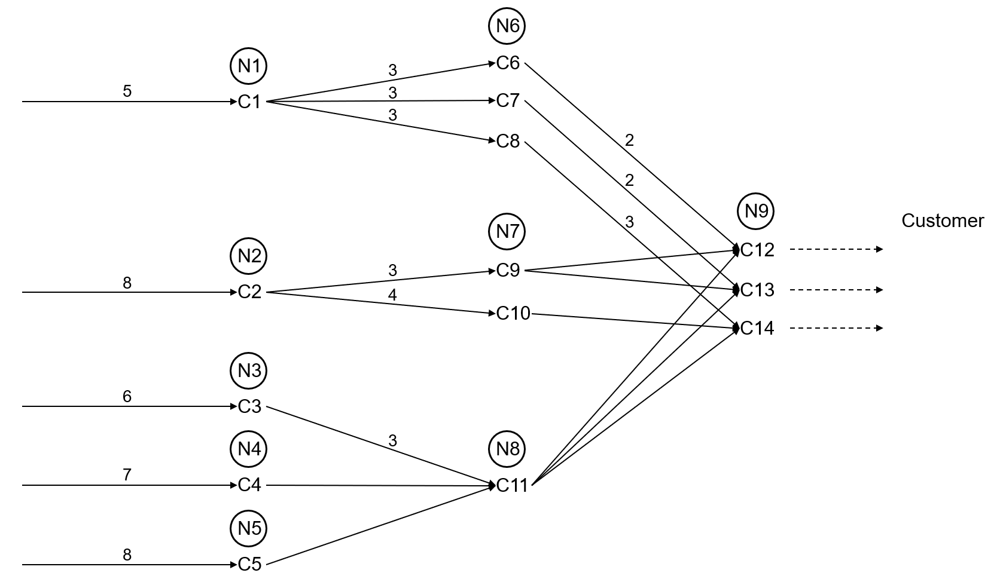

# Research Challenge: Production-Inventory Planning at ASML

## Build Your Policy
This challenge is highly accessible for participation—read the problem statement, register, download the prepared code, and build your policy!  

\* The winners and runners-up are awarded with, respectively, 500 and 200 Euro prize money.  
** The winners will be invited to submit their solution as part of a (collaborative) paper to the _International Journal of Production Economics_.

## Introduction
At ASML, efficient production and inventory planning is critical to ensuring competitive operational performance, yet it remains very challenging due to the complexity of our high-tech low-volume manufacturing environment. Demand is highly uncertain and non-stationary, often influenced by business cycles, while extensive production lead times necessitate planning based on long-term forecasts. A key characteristic of our engineering and manufacturing process is modular product design, which drives flexibility and efficiency. The resulting component commonality across multiple end items in the product portfolio enhances adaptability, but it significantly complicates the optimization of production and inventory levels due to the general-structure network. At the same time, tight production capacity constraints across multi-tier supplier networks add to the complexity of decision-making. Given the extreme cost of products and resources in this high-tech industry, even slight inefficiencies in inventory planning can have significant financial consequences, reinforcing the need for efficient solution methodologies.

While the problem considered in this research challenge is not directly derived from ASML’s operational setting, it captures the fundamental challenges inherent to planning challenges in high-tech low-volume manufacturing. The developed methodologies and insights, therefore, are expected to enhance practical planning processes at ASML.

Although the problem setting is complex, the core of the challenge is straightforward. You are asked to develop a policy that satisfies external customer demand as efficiently as possible, minimizing the total costs incurred in the supply chain. Here, your policy should prescribe the production-inventory decisions for all manufacturing steps given any state of the supply chain.

## Assessment Procedure
Assessment of the submissions will be conducted by the Committee using a blinded review process based on the following criteria:  
* the quality, generalizability, scalability, and novelty of the solution approach;
* the significance of the findings and insights.

## Timeline
February 18, 2025: Launch competition.  
July 11, 2025: Deadline submission.  
August 1, 2025: Announcement finalists.  
August 25-29, 2025: Presentations by finalists during the ISIR Summer School 2025 (exact date
to be determined).

## Submission Guidelines
Submissions can be done by sending an e-mail to t.l.vandijck@tilburguniversity.edu, including the following:
* a title page with names, e-mail addresses, and affiliations of group members;
* a report (without author identifiers) exhibiting the _solution approach_, _results_ and _insights_;
* the developed code (without author identifiers).

## Committee Bio
Tjum van Dijck (Tilburg University, ASML)  
Tijn Fleuren (ASML, Head of Planning & Delivery Strategy Research; Tilburg University)  
Maarten Hendriks (ASML, Head of Planning & Delivery Strategy; Tilburg University)  
Tarkan Temizöz (Eindhoven University of Technology)  
Willem van Jaarsveld (Eindhoven University of Technology)

## Important Notes
* Although the case is motivated by the practice, data are anonymized for reasons of confidentiality.
* The goal is to develop an inventory planning policy, which can be directly implemented into an already fully coded simulation framework. The simulation is pre-built, requiring only the integration of your policy without extensive additional coding.

## Problem Statement
The primary goal is to develop an effective inventory planning policy for managing the entire supply chain depicted below. This supply chain consists of nine nodes, each handling its own set of components. There are three end-products, i.e., C12, C13, and C14, each subject to uncertain customer demand. These products are assembled at the final assembly stage (node 9) from three components, which are themselves produced from externally sourced materials. Each production and assembly process involves a deterministic lead time, indicated by the numbers on the arcs. These lead times are governed by either supply agreements or internal production capabilities. To initiate an assembly process, all required materials must be available, necessitating synchronization of incoming lead times. For example, assembling C12 takes two periods, meaning the lead time from C9 and C11 to C12 is also two periods. Additionally, nodes have production capacity constraints, limiting the total output per period for that node—e.g., the aggregate production of components C6, C7, and C8 per period is restricted.  

The supply chain incurs a per period unit inventory holding cost for maintaining positive on-hand inventory for each component. To ensure high service levels, any unmet demand results in a per period unit backlog penalty for each end-product. The uncertain external customer demand exhibits time correlation, for which we assume a stylized model. The aggregate demand for the three products, representing the overall market, follows an autoregressive (AR) process, and is stochastically allocated among the three end-products, whose demands are rounded to obtain integer quantities. Below the supply chain figure, we provide additional detailed information on the demand process, including an example. Given the low-volume setting, the decision variables are also integer-valued. All input parameters can be found in the provided data.  

The objective is to establish an inventory planning policy that minimizes total expected costs over a five-year planning horizon. This policy prescribes (optimal) production-inventory planning decisions for all components across the supply chain in each time period.  

  

### Demand Sampling
The total aggregated demand for the three products follows an ARMA model, with lags specified in the dataset. The model incorporates eight lag values: [0.6, 0.5, -0.2, -0.2, 0.2, -0.2, 0.1, -0.1].

We use a stochastic allocation method to allocate this total demand among the three products. Specifically, a random value is sampled for each product from a gamma distribution with predefined parameter values. The demand for each product is then determined by normalizing these sampled values against their total sum. The process is illustrated with the following example:

Assume that the historical aggregated demand from previous periods is given as [17.7, 15.1, 15.8, 15.0, 13.9, 11.5, 13.9, 11.9], where the first value corresponds to $t-1$, the second to t-2, and so on.  Using the ARMA model, the aggregated total demand for the current period is calculated as: _0.6*17.7 + 0.5*15.1 + ⋯ + _N_(0,σ) = 18.4_. 
For the allocation, we sample values from gamma distributions: Product 1: Gamma(11.67, 0.6) → 11.15, Product 2: Gamma(8.33, 0.6) → 9.10, Product 3: Gamma(5, 0.6) → 4.33. 
Next, we randomly determine the order in which products are assigned demand. Suppose the order is 2,1,3. The demand is then allocated as follows: Product 2: round(9.10/24.58*18.4) = 7, Product 1: round(11.15/24.58 * 18.4) = 8, and Product 3: the remaining integer demand = 3. 

## Repository Details
The framework has a pre-build simulation that runs the planning horizon for any given policy. The [supply_chain_config](src/supply_chain_config.py) file processes the input data and translates it into the necessary supply chain attributes. All time-period dynamics are handled in the [dynamics](src/dynamics.py) file, which also includes a check of whether the prescribed actions from the policy are allowed. There are two main functions to evaluate our policy, both located in the [evaluate](src/evaluate.py) file: one tests a single policy over a given number of trajectories and periods, while the other compares multiple policies.

You are asked to implement your policy class in the [policy](src/policy.py) file, which must contain a set_action function that takes the state (see [state](src/state.py) file) as input and returns the production quantity for each component in the supply chain.

## Data Details
A comparable dataset can be used to evaluate and analyze performance across various supply chain configurations. The data is derived from the [supply_chain_configuration](data/supply_chain_configuration.xlsx) file, which comprises multiple sheets detailing distinct aspects of the supply chain.

The BillOfMaterials sheet defines the supply chain structure, listing all components in the first row and column. The data is structured such that if component C1 is a predecessor of C5, the corresponding row entry for C1 in column C5 is marked as 1; otherwise, it is 0. The Capacity sheet provides information on different nodes, each consisting of multiple components sharing a common capacity. Each end-product in the supply chain must contain exactly one component from each node. The LeadTimes and HoldingCosts sheets contain deterministic lead times and holding costs for each component. Due to the additive nature of assembly operations, the holding cost of each component exceeds the sum of its predecessors' holding costs. The BacklogPenalties sheet details per-period unit backlog penalty costs for each end-product. The AggregateDemandModel sheet  includes the lags of the ARMA model and the standard deviation of the error for aggregated demand. Lastly, the ProductDemandMean sheet provides the mean demand and the moments of the stochastic allocation for each end-product.
